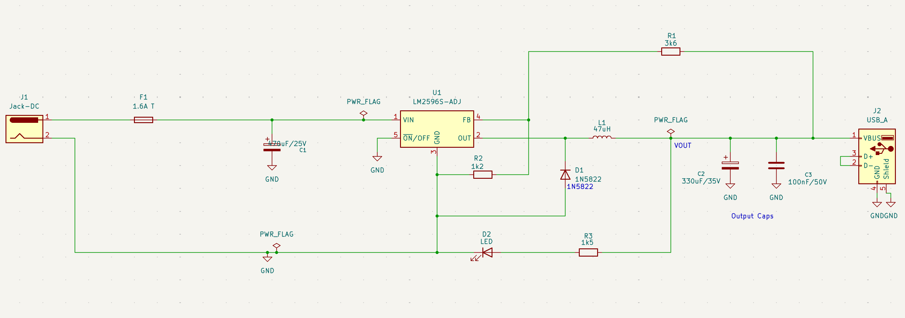
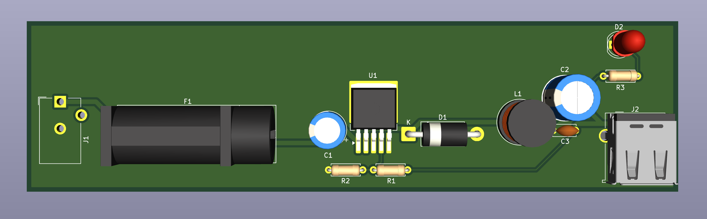

# USB_POWER_SUPPLY_PCB

I started this project shortly before beginning my electrical engineering
studies, as a way to learn electronics and get hands-on experience. A 12 V
to 5 V USB step-down supply seemed like a good first PCB build, and having
now designed and assembled it, I think that was the right call.

 ## Design

I went with a buck converter rather than a linear regulator, since dropping
12 V to 5 V linearly would waste a very significant amount of power as heat. 
The LM2596S-ADJ handles the switching, and a 1N5822 Schottky diode carries the 
inductorcurrent while the internal switch is off. The feedback pin regulates 
to 1.23 V, so the 3.6 kΩ and 1.2 kΩ divider sets the output to about 4.9 V, 
and a 47 µH inductor smooths the current.

On the input side, a 1.6 A slow-blow fuse protects against shorts and a
470 µF capacitor supplies the pulsed current the converter draws when
switching. At the output, a 330 µF electrolytic and a 100 nF ceramic reduce
ripple, the USB D+ and D- lines are shorted so devices recognise it as a
charger, and a power LED shows when the output is live.

## PCB

The board is a 2-layer measuring approximately 145 × 38 mm design routed in
KiCad, with one SMD component and the rest being through-hole and a ground 
pour on the bottom layer. I kept the input capacitor, LM2596, diode and
inductor close together to keep the high-current switching loop small, which
reduces noise and ringing.

The feedback trace is routed away from the inductor and switching node so
the output regulation isn't disturbed, and the power traces are widened to
1 mm1 to handle the current. 

## What I learned

This was my first time taking a circuit all the way from schematic to a
working board. I learned how a buck converter works in practice, how to read
a datasheet to choose supporting components, and how much layout matters
for switching circuits. The build also taught me the practical side:
footprints, ordering parts and hand soldering.

## Next revision (in progress)

I am making a second board with the same function but far more compact 4-layer
design, 41 × 37 mm, built around the TI LMR33630. Unlike the LM2596, it's
a synchronous converter with an integrated low-side switch, so the Schottky
diode is gone and efficiency should improve, especially at higher loads. It
also switches at 400 kHz instead of 150 kHz, which allows a smaller 10 µH
inductor and ceramic output capacitors in place of the large electrolytic.
The divider is now 100 kΩ / 24.9 kΩ against a 1.0 V reference, putting the
output at 5.02 V.

The board has already been fully designed and routed in KiCad the only steps
left are ordering parts, assembing and testing.

Once the secound board is assembled and ready I'll compare the two boards on 
efficiency, output ripple and temperature

